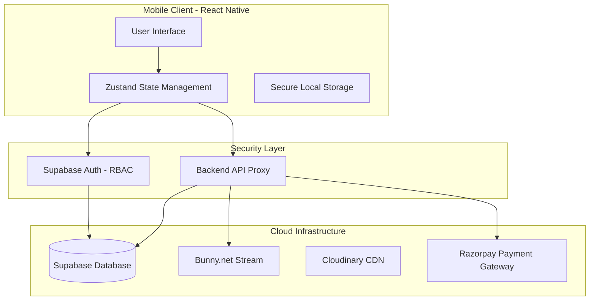

# EduOrbit LMS - Enterprise-Grade Mobile Learning Platform 🚀

> **The comprehensive, white-label ready Learning Management System built for scale.**

**EduOrbit** is a high-performance, cross-platform mobile application designed to power modern education businesses. Built with **React Native (Expo)** and a scalable **Supabase** backend, it offers a seamless, "Netflix-grade" learning experience for students and a powerful command center for administrators.

## 🌟 Executive Summary

EduOrbit is not just an app; it's a complete **Digital Academy in a Box**. It solves the core challenges of ed-tech businesses: **Monetization, Engagement, and Content Security**.

*   **💰 Monetization Ready:** Integrated payment gateway (Razorpay), coupon engine, and automated access expiry.
*   **🔒 Enterprise Security:** Role-Based Access Control (RBAC), DRM-ready video streaming, and backend-proxied transactions.
*   **📱 Offline-First:** Robust download manager allows students to learn without internet, increasing retention in low-bandwidth areas.
*   **⚡ Scalable:** Built on serverless architecture (Supabase + Bunny.net) to handle 10k+ concurrent users with minimal overhead.

## 📱 Key Features

### For Students (Learning Experience)
*   **Cinema-Grade Player:** Adaptive bitrate streaming (HLS) that adjusts to network speed automatically.
*   **Smart Offline Mode:** Securely download videos for offline viewing (encrypted storage).
*   **Progress Sync:** "Pick up where you left off" functionality across devices.
*   **Enhanced Analytics:** Deep insights into personal learning progress via intuitive charts.
*   **Gamified Journey:** Automated certificate generation and progress tracking.
*   **Community & Notifications:** Real-time chat support and slide-down in-app alerts.

### For Administrators (Business Control)
*   **Mobile Command Center:** A polished, "Fresh UI" with subtle gradients and glassmorphism.
*   **Real-Time Analytics:** Track revenue, active users, and course performance instantly.
*   **Content Studio:** Upload courses, videos, and resources directly from mobile.
*   **User Management:** Granular control over student access, extensions, and manual enrollments.

## 🏗️ Technical Architecture

The system is architected for **Security, Scalability, and Performance**.

### Tech Stack
*   **Frontend:** React Native 0.81, Expo SDK 54, TypeScript
*   **Styling:** NativeWind (Tailwind CSS)
*   **State Management:** Zustand (Lightweight, High Performance)
*   **Backend:** Supabase (PostgreSQL, Auth, Edge Functions)
*   **Video Engine:** Bunny.net (HLS Streaming, global CDN)
*   **Payments:** Razorpay (India's leading gateway)

## 📂 Project Structure

```
mobile/
├── src/
│   ├── components/       # Atomic UI components
│   ├── lib/              # Core infrastructure (Supabase, Bunny, Storage)
│   ├── navigation/       # Navigation stacks (Auth, Student, Admin)
│   ├── screens/          # 50+ Optimized screens
│   │   ├── admin/        # Business logic screens
│   │   └── student/      # Learning experience screens
│   ├── store/            # Global state management
│   └── utils/            # Helpers and formatters
└── app.json              # Expo configuration
```

## 🚀 Getting Started

1.  **Clone the repository:**
    ```bash
    git clone https://github.com/your-username/lms-eduorbit-app.git
    cd lms-eduorbit-app
    ```

2.  **Install dependencies:**
    ```bash
    npm install
    ```

3.  **Environment Setup:**
    Create a `.env` file based on `.env.example`.
    > **Note:** Critical secrets (Payment Keys, Video API Keys) are **NOT** required in the mobile app. They are securely managed by the Backend API.

4.  **Run the app:**
    ```bash
    npx expo start
    ```

## 📄 License
Commercial / MIT
