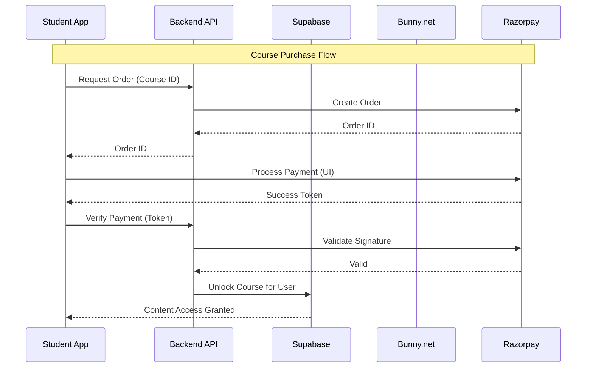

# Technical Architecture & Stack Decisions

## 🎯 Architecture Philosophy
The EduOrbit architecture was chosen with three guiding principles:
1.  **Cost Efficiency:** Minimize fixed costs (server idle time) to maximize margins.
2.  **Performance:** Native 60fps experience with instant load times.
3.  **Developer Experience:** Type-safe, modular code for rapid iteration.

---

## 🛠️ The Stack (And Why We Chose It)

### 1. Frontend: React Native (Expo)
*   **Why:** "Write Once, Run Everywhere." Allows us to ship iOS and Android apps from a single TypeScript codebase.
*   **Benefit:** Reduces engineering salary costs by 50% compared to maintaining separate Swift (iOS) and Kotlin (Android) teams.
*   **Performance:** Uses the Hermes engine for instant startup times and smooth animations.

### 2. Backend: Supabase (BaaS)
*   **Why:** Provides Database, Auth, Storage, and Real-time subscriptions out of the box. It is an open-source Firebase alternative built on PostgreSQL.
*   **Benefit:** Enables instant live-sync for in-app notifications and chat. Saves months of backend boilerplate development.
*   **Scalability:** Built on PostgreSQL, the industry-standard for reliability. Can handle millions of complex queries.

### 3. Video Engine: Bunny.net
*   **Why:** Specialized video CDN with built-in transcoding and security.
*   **Cost Advantage:**
    *   **Bunny:** ~$0.005 per GB
    *   **AWS CloudFront:** ~$0.085 per GB
    *   **Result:** **17x Cheaper** video delivery costs.
*   **Feature:** Automatic HLS (Adaptive Bitrate) transcoding ensures videos play smoothly on 2G/3G networks.

### 4. Payments: Razorpay via Backend Proxy
*   **Why:** Best success rates in the target region (India).
*   **Security:** We implemented a "Backend Proxy" pattern. The mobile app never touches the secret keys. It asks the server to create an order, and the server talks to Razorpay. This prevents key leakage and fraud.

---

## 🏗️ System Diagram

## 🔒 Security Measures

### Data Security
*   **Row Level Security (RLS):** Logic lives in the database. Even if a hacker accesses the API, the database itself rejects queries that try to read another user's data.

### Video Security (DRM-Lite)
1.  **Signed URLs:** Video links expire after 1 hour.
2.  **Referrer Check:** Videos only play if the request comes from our specific App ID.
3.  **Encryption:** Offline downloads are stored in an encrypted sandbox.

## 📉 Infrastructure Costs (Estimated)

For 1,000 Active Students:
*   **Database (Supabase):** $25/month (Pro Plan)
*   **Video Hosting (Bunny):** ~$10/month (assuming 2TB bandwidth)
*   **App Hosting:** $0 (Vercel/Netlify Free Tier for API)
*   **Total Fixed Cost:** **~$35/month**

**Conclusion:** The stack is optimized for **extreme profitability**, requiring minimal user revenue to break even.
